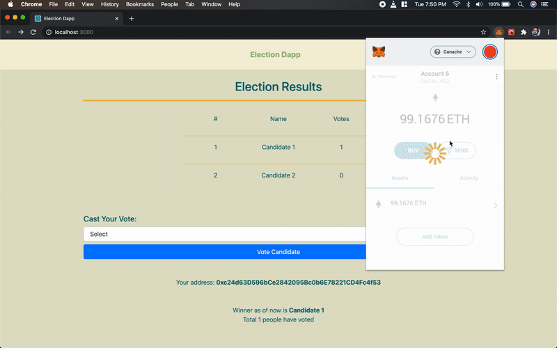

# Election DApp

#### Simple election decentralized app to vote between two candidates

### 

#### To use:

      - Pre-Install truffle, ganache, metamask: browser extension, node
      - Clone this repository
      - Open this folder in terminal
      - Type "npm i" (It will take some time)
      - Now type "npm start"
      Done!

#### Contract rules

      - There are two candidates, "Candidate 1" and "Candidate 2"
      - Vote can be casted to only above candidates
      - Vote can be casted only once. (This is why the transaction fails when "Account 8" tries to vote twice)

###### \*used solidity compiler version 0.5.0
